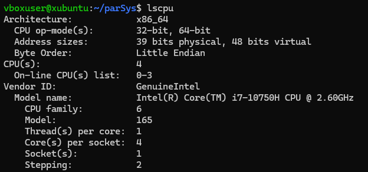

# Parallele und Verteilte System WS2024

### Aufgabe 1.2.1 exp. FLOPs/sek.-Bestimmung für eine selbst gewählte Plattform

1. Testsystem, Latop der Hochschule Wismar
- Prozessor: Intel(R) Core(TM) i7-8700K CPU @ 3.70GHz
- besitzt 12 logische Prozessoren 

        Architecture:           x86_64
        CPU op-mode(s):         32-bit, 64-bit
        Address sizes:          39 bits physical, 48 bits virtual
        Byte Order:             Little Endian
        CPU(s):                 12
        On-line CPU(s) list:    0-11
        Vendor ID:              GenuineIntel
        Model name:             Intel(R) Core(TM) i7-8700K CPU @ 3.70GHz

- die initialen Tests verliefen ja nicht so gut
- wir hatten festgestellt, dass möglicherweise der Compiler alles "wegoptimiert"
- deswegen müssen wir den Code noch einmal überarbeiten

        void* perform_operations(void* arg) {
            ThreadData* data = (ThreadData*) arg;
            double a = 1.01, b = 1.01, local_result = 0.0;

            for (long i = data->start; i < data->end; i++) {
                local_result += a * b;
            }

            data->result = local_result;
            pthread_exit(NULL);
        }

- die vermutete Ursache war, dass der Compiler erkennt, dass das Ergebnis nicht außerhalb der Schleife benötigt wird
- meine Vermutung: alle Threads arbeiten mit den selben Konstanten A und B, deswegen werden diese vermutlich im Cache der CPU gehalten
- zusätzlich vermute ich, dass IDEs zusätzliche Optimierungen durchführen oder parallele Threads benutzen
- bisher hatte ich CLion verwendet

**Lösungsvorschlag:**
- gcc in einer Linux-Umgebung verwenden
- statt einer einfachen Multiplikation, eine Matrix-Multiplikation implementieren
- reines C verwenden
- auf ein Gerät beschränken
- den Laptop der Hochschule habe ich aktuell nicht mehr
- ich bin über Weihnachten bei meinen Eltern
- deswegen nur ein Rechner, mit einer Linux-VM
- ist "quasi" das gleiche wie der Laptop der Hochschule, dieser war auch nur ein Dual-Boot PC
- dazu habe ich mal Claude.ai befragt und den "neuen" Code ausführlich auskommentiert
- es fällt direkt auf, dass dieser dem alten Code relativ ähnlich ist

**Anmerkungen**
- für die Übersichtlichkeit habe ich das Projekt neu strukturiert
- im Ordner **"einsendung_alt"** befinden sich meine Einsendungen, die du bereits gesichtet hast
- darin befinden sich die alten Dokumentationen und der alte von mir eingesendete Code
- im Ordner **"einsendung_neu"** befindet sich der überarbeitete Code
- die Doku erhält einen eigenen Ordner **"DOKU"**
- ich verwende eine Ubuntu-VM
- genauer gesagt ein **xubuntu-22.04.2-desktop-amd64**

**Ergebnisse gflopMessung.c**
- gcc Version:

- Testsystem:
- dieses System kennst du schon, dass ist mein Arbeitslaptop, mit einer Ubuntu-VM
- CPU: Intel(R) Core(TM) i7-10750H CPU @ 2.60GHz

- die VM bekommt von mir 4 physische Kerne
- laut der Ausgabe von lscpu, haben wir auch nur 4 logische Kerne
- Threads per Core ist ebenfalls 1, es gibt also keinen Hinweis auf Hyper-Threading!!!
- damit sind die Hardware Spezifikationen geklärt und wir können beginnen, Messungen durchzuführen
- die Erklärung für die verwendeten C-Programme finden sich in den Kommentaren der **gflopMessung.c** und den anderen .c Dateien
- für die "grafische" Überwachung verwende ich den Gnome-System-Monitor um die Auslastung der einzelnen Kerne zu beobachten

#### Test 1

- ausführen des Kompilats von **gflopMessung.c**
- verwendeter Befehl: **gcc -o gflopMessung gflopMessung.c**

- Ausgabe des Programms:

        Matrix-Größe: 1024 x 1024
        Benötigte Zeit: 12.42 Sekunden
        Performance: 0.17 GFLOPS

#### Test 2

- ausführen des Kompilats von **gflopMessung.c**
- verwendeter Befehl: **gcc -O3 -o gflopMessung gflopMessung.c**
- was macht **-O3**?
- Optimierungsoption, am häufigsten finde ich im Internet dazu den Mechanismus "Loop Unrolling", dabie können Schleifen schneller ausgeführt werden und auch miehrere Iterationen zusammen

- Ausgabe des Programms: 

        Matrix-Größe: 1024 x 1024
        Benötigte Zeit: 2.88 Sekunden
        Performance: 0.75 GFLOPS

- macht also schon einen großen Unterschied

#### Test 3

- hier möchte ich testen, ob ich auch alle 4 Kerne benutzen kann
- dafür gibt es das Programm **multi_gflopMessung.c**
- verwendeter Befehl: **gcc -O3 -fopenmp -o multi_gflopMessung multi_gflopMessung.c**
- außerdem übergebn wir dem Linker ein zusätzliches Element, das ist für den import von <omp.h> zuständig
- hier auch mit doppelter Matrixgröße 2048
- sonst bin ich nicht schnell genug den Screenshot zu machen ;)

- hier sieht man auch ganz schön, dass alle CPUs am arbeiten sind
- jede CPU erhält einen eigenen Thread
- Ausgabe des Programms:

        Anzahl verwendeter Threads: 4
        Matrix-Größe: 2048 x 2048
        Block-Größe: 32
        Durchschnittliche Zeit pro Durchlauf: 4.31 Sekunden
        Performance: 3.99 GFLOPS
        Performance pro Kern: 1.00 GFLOPS

- bei geringere Matrixgröße sind es sogar noch mehr GFLOPS: 

        Anzahl verwendeter Threads: 4
        Matrix-Größe: 1024 x 1024
        Block-Größe: 32
        Durchschnittliche Zeit pro Durchlauf: 0.46 Sekunden
        Performance: 4.70 GFLOPS
        Performance pro Kern: 1.18 GFLOPS

- vielleicht wird bei mehr Operationen auch wieder mehr im Cache gespeichert!

### Aufgabe 1.2.2 exp. Latenz- + TR-Bestimmung für eine selbst gewählte Plattform
- in diesem Abschnitt werde ich auf die Dateien **server_rtt.c, client_rtt.c und client_tr.c** eingehen
- die unkommentierten und unangepassten Dateien findest du auch im Ordner **einsendung_alt**
- die überarbeiteten Varianten, mit denen ich auch die Messungen durchführe, sind im Ordner **einsendung_neu**
- mir ist auch jetzt erst aufgefallen, dass es sich bei der ersten Einsendung um einen linux-Server und einen Windows-Client handelt
- von daher ist die neue Einsendung komplett POSIX-konform
- danke auf jeden Fall für den Hinweis

**RTT-Messung**
- Posix konform angepasst
- verwendete Befehle: **gcc -o client_rtt client_rtt.c, gcc -o server_rtt server_rtt.c**
- wir verwenden wieder das Gleiche Gerät wie bei der GFlop-Messung!
- das **client_rtt.c** Programm erweitert, mit Hilfe von Claude.ai
- jetzt wird die RTT nicht nur für das loopback-device gemessen, sondern auch für mein lokales Netzwerk, für den Google DE DNS Server "8.8.8.8" und für irgendeinen Server in Amerika wo Port 80 zugelassen ist
- wichtig anzumerken ist, dass es sich ja um eine VM handelt
- das heißt, dass das Standard-Gateway nicht mein Router ist, sondern das Host System der virtuellen Maschine
- bei mir ist das die "10.0.2.2"
- das heißt auch, dass ich auf meinem Host einen echo-Server haben muss
- ich habe mir erlaubt, dass schnell mit Python zu machen

- jetzt starte ich also auf meinem Host das Python Skript und auf meiner xubuntu-VM die **server_rtt**
- dann kann ich die **client_rtt** starten und erhalte die folgenden Ausgabe:

        Testing Localhost (127.0.0.1):
        ----------------------------------------
        Ping 1: 0.023 ms
        Ping 2: 0.020 ms
        Ping 3: 0.021 ms
        Ping 4: 0.063 ms
        Ping 5: 0.020 ms
        Ping 6: 0.021 ms
        Ping 7: 0.021 ms
        Ping 8: 0.022 ms
        Ping 9: 0.021 ms
        Ping 10: 0.021 ms

        Statistics for Localhost:
        Minimum = 0.020 ms
        Maximum = 0.063 ms
        Average = 0.025 ms
        Success rate: 10/10

        Testing Local Network (10.0.2.2):
        ----------------------------------------
        Ping 1: 0.777 ms
        Ping 2: 0.398 ms
        Ping 3: 0.677 ms
        Ping 4: 0.646 ms
        Ping 5: 0.484 ms
        Ping 6: 0.420 ms
        Ping 7: 0.890 ms
        Ping 8: 0.495 ms
        Ping 9: 0.451 ms
        Ping 10: 3.274 ms

        Statistics for Local Network:
        Minimum = 0.398 ms
        Maximum = 3.274 ms
        Average = 0.851 ms
        Success rate: 10/10

        Testing Google DE (8.8.8.8):
        ----------------------------------------
        Ping 1: 18.110 ms
        Ping 2: 18.523 ms
        Ping 3: 18.986 ms
        Ping 4: 18.013 ms
        Ping 5: 18.695 ms
        Ping 6: 18.708 ms
        Ping 7: 18.908 ms
        Ping 8: 19.496 ms
        Ping 9: 31.471 ms
        Ping 10: 28.092 ms

        Statistics for Google DE:
        Minimum = 18.013 ms
        Maximum = 31.471 ms
        Average = 20.900 ms
        Success rate: 10/10

        Testing US Server (104.16.123.96):
        ----------------------------------------
        Ping 1: 14.513 ms
        Ping 2: 11.826 ms
        Ping 3: 12.299 ms
        Ping 4: 12.474 ms
        Ping 5: 14.851 ms
        Ping 6: 12.167 ms
        Ping 7: 12.829 ms
        Ping 8: 12.473 ms
        Ping 9: 13.123 ms
        Ping 10: 11.707 ms

        Statistics for US Server:
        Minimum = 11.707 ms
        Maximum = 14.851 ms
        Average = 12.826 ms
        Success rate: 10/10

- die Erklärung des Codes ist wie immer in den Kommentaren des entsprechenden .c Files zu finden
- 104.16.123.96 gehört übrigens zu Cloudflare (San Francisco)
- Cloudfare beschäftigt sich mit dem Schutz von Webseiten

**TR-Messung**
- hierfür müssen wir nur die **client_rtt.c** anpassen
- dann müssen wir eine Bestimmte Größefür die Datenpakete festlegen
- dies wird am Anfang definiert

        #define BUFFER_SIZE 1024  // Größe eines einzelnen Pakets (1 KB)
        #define DATA_SIZE (1024 * 1024)  // Gesamte zu sendende Datenmenge (1 MB)
        

- dann wird die Transfer Zeit gemessen, wie lange das Senden und Empfangen dauert
- dann wird die Transfer-Rate berechnet = Datenmenge in Megabits/ Transfer-Zeit in Sekunden
- wir erhalten die Einheit **Mbps**
- Ergenisse:

        Testing Localhost (127.0.0.1):
        ----------------------------------------
        Transfer Rate for Localhost: 1431.000 Mbps

        Testing Local Network (10.0.2.2):
        ----------------------------------------
        Transfer Rate for Local Network: 393.186 Mbps

        Testing Google DE (8.8.8.8):
        ----------------------------------------

- google und der andere Server erhalten kein Ergebnis
- diese sind nämlich nicht als Echo-Server kofiguriert!